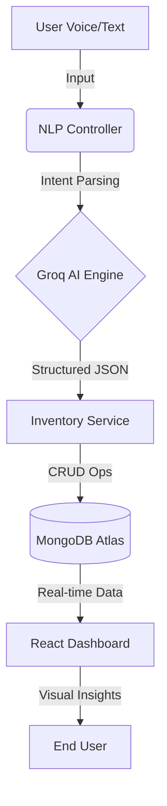

# 📦 Smart Inventory Crud Web Application With NLP
> **Intelligence in Motion. Logistics Reimagined.**

**Smart Inventory Crud Web Application With NLP** is a high-fidelity, full-stack Smart Inventory Management system that bridges the gap between traditional CRUD operations and **Natural Language Intelligence**. Built for modern operations, it allows users to manage complex inventory flows using simple voice and text commands.


---

## ✨ Core Innovations

### 🎤 NLP & Voice Command Engine
Stop clicking, start talking. **Smart Inventory Crud Web Application With NLP** features a custom-built **Natural Language Processing (NLP)** layer that interprets conversational English into database actions.
*   *"Add 50 laptops to stock"*
*   *"Increase chair inventory by 10"*
*   *"Show me all products with low stock"*

### 🛡️ Resilience & "Always-On" Demo Mode
Designed for high-stakes presentations. The system features a **Multi-Tier Database Fallback**:
*   **Cloud Mode**: Connects to MongoDB Atlas.
*   **Emergency Bypass**: Includes a built-in "Demo Admin" (`admin@smartinventory.app`) that works even without an internet connection or if the database is blocked by firewalls.

### 📊 AI Health Scoring
A dynamic KPI engine that calculates the real-time "Health" of your inventory based on stock movement, dead stock periods, and overstock thresholds.

---

## 📐 System Architecture



---

## 🛠️ Technology Stack


| Layer | Technologies |
| :--- | :--- |
| **Frontend** | React 18, Vite, Framer Motion, Tailwind CSS, Lucide Icons |
| **Backend** | Node.js, Express.js, JWT Security, Bcrypt Hashing |
| **Intelligence** | Llama 3.3 (via Groq AI), Web Speech API |
| **Data** | MongoDB Atlas, Mongoose ODM |

---

## 🚀 Quick Start (Demo Mode)

To run the project locally and see the "Smart" features in action:

1. **Clone & Install**:
   ```bash
   # Backend
   cd backend && npm install && npm run dev
   
   # Frontend
   cd frontend && npm install && npm run dev
   ```
2. **Access**: Open `http://localhost:3000`
3. **Login (Instant Demo)**:
   *   **User**: `admin@smartinventory.app`
   *   **Pass**: `admin123`

---

## 👨‍💻 Developed By

This project was developed as a collaborative engineering effort by:

*   **Om Ashok Shedage** - *PRN: 2267571242112*
*   **Rohit Rajendra Gaikwad** - *PRN: 2267571242113*
*   **Prathmesh Gajanan Sose** - *PRN: 2267571242114*
*   **Sujit Bhauso Chavan** - *PRN: 2267571242115*
*   **Jay Sanjay Ithape** - *PRN: 2267571242120*

---

## ⚡ Voice Command Examples
You can use these directly in the **Voice AI** or **Chat AI** sections:
*   `"Create product iPhone 15 with price 79000"`
*   `"Update Macbook price to 125000"`
*   `"Add 5 units of Sony Headphones"`
*   `"Remove 2 units from Tablet stock"`

---
⭐️ **If this project helped you, give it a star on GitHub!**
thank you
